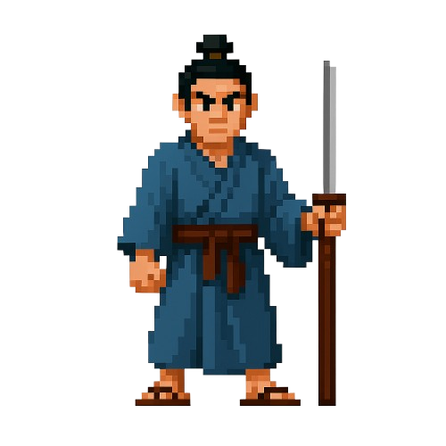
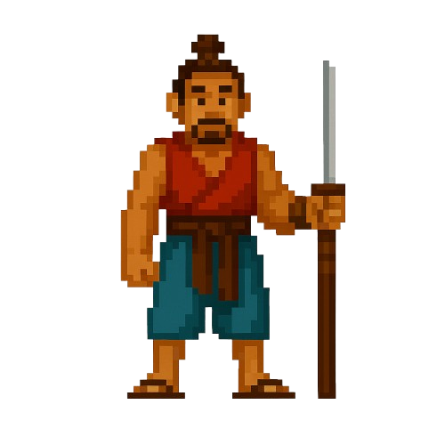
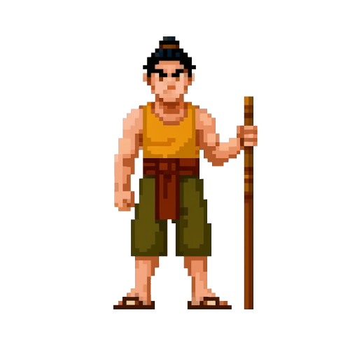
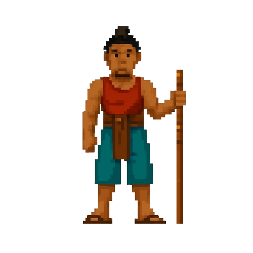
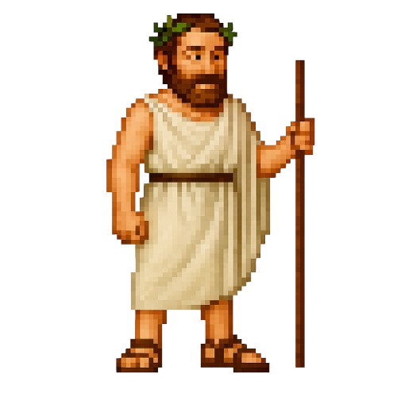
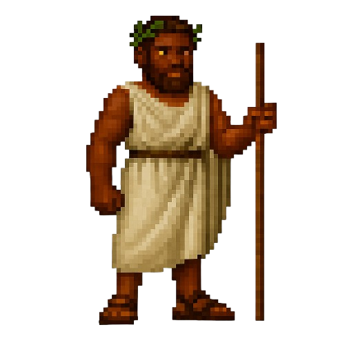
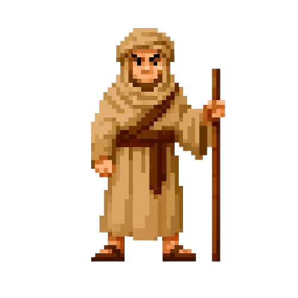
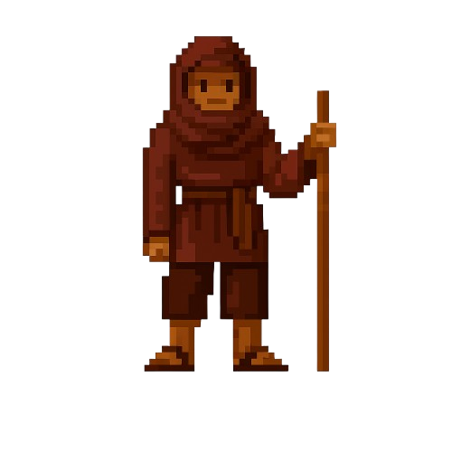
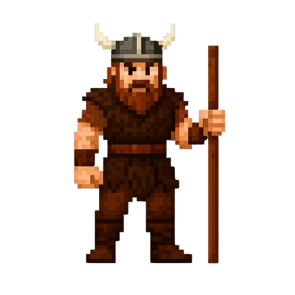
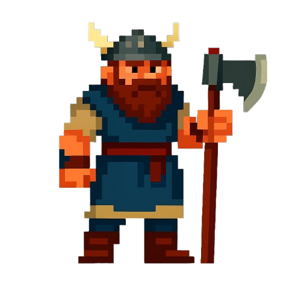

# Ludoria - Manuel d'utilisation

<div style="display: flex; flex-wrap: wrap; justify-content: center;">












</div>

> [!TIP]
> Ce manuel explique comment installer, lancer et jouer aux différents jeux de la suite Ludoria (Katerenga / Congress / Isolation).

## Table des matières

- [Ludoria - Manuel d'utilisation](#ludoria---manuel-dutilisation)
  - [Table des matières](#table-des-matières)
  - [Installation](#installation)
  - [Lancement des jeux](#lancement-des-jeux)
  - [Règles du jeu](#règles-du-jeu)
    - [Katarenga](#katarenga)
    - [Congress](#congress)
    - [Isolation](#isolation)
  - [Modes de jeu](#modes-de-jeu)
    - [Mode solo](#mode-solo)
    - [Mode contre l'IA](#mode-contre-lia)
    - [Mode multijoueur en réseau](#mode-multijoueur-en-réseau)
  - [Interface du jeu](#interface-du-jeu)
  - [Sauvegarde et chargement](#sauvegarde-et-chargement)

## Installation

Pour installer Ludoria, suivez ces étapes :

1. Assurez-vous d'avoir Python 3.10 ou supérieur installé sur votre système.
2. Clonez le dépôt GitHub ou téléchargez le code source.
3. Ouvrez un terminal à la racine du projet.
4. Installez les dépendances requises :

```bash
pip install -r requirements.txt
```

## Lancement des jeux

Pour lancer l'application et choisir un jeu :

```bash
python client.py
```

Pour démarrer un serveur multijoueur (nécessaire uniquement pour le mode réseau) :

```bash
python start_server.py
```

L'écran de sélection vous permettra de choisir :
- Le jeu que vous souhaitez jouer (Katarenga, Congress ou Isolation)
- Le mode de jeu (Solo, contre IA, ou Multijoueur en réseau)
- Charger une partie sauvegardée

## Règles du jeu

### Katarenga

> [!NOTE]
> Katarenga est un jeu de stratégie où les mouvements des pièces dépendent de la couleur des cases.

**Plateau de jeu :** 10×10 cases (8×8 central + 4 camps aux coins)

**Configuration initiale :** 
- Joueur 1 (blanc) : 8 pièces sur la deuxième rangée 
- Joueur 2 (noir) : 8 pièces sur l'avant-dernière rangée

**Règles de déplacement :**
- **Case rouge** : déplacement orthogonal (comme une tour aux échecs)
- **Case verte** : déplacement en "L" (comme un cavalier aux échecs)
- **Case bleue** : déplacement d'une case dans toutes les directions (comme un roi)
- **Case marron** : déplacement en diagonale (comme un fou aux échecs)

**Capture :** Une pièce est capturée lorsqu'une pièce adverse prend sa place. 

**Conditions de victoire :**
1. Occuper les deux camps adverses (coins opposés du plateau).
2. Bloquer complètement l'adversaire (plus aucun mouvement possible).

**Règle spéciale :** Au premier tour, les captures ne sont pas autorisées.

### Congress

> [!NOTE]
> Congress est un jeu de positionnement où l'objectif est de former une connexion enter toutes les pièces orthogonalement.

**Plateau de jeu :** 8×8 cases

**Configuration initiale :** 
- Chaque joueur commence avec 8 pièces disposées sur des positions spécifiques.

**Règles de déplacement :**
- ...
- Pas de captures de pièces dans ce jeu.

**Condition de victoire :**
- Avoir toutes les pièces au moins orthogonale à une autre pièce.

### Isolation

> [!NOTE]
> Isolation est un jeu de blocage où le but est d'empêcher l'adversaire de pouvoir jouer.

**Plateau de jeu :** 8×8 cases

**Configuration initiale :** 
- Le plateau est vide au début de la partie.

**Règles de déplacement :**
- À chaque tour, placez une tour sur n'importe quelle case vide.
- Une tour ne peut pas être placée sur une case menacée par une tour adverse. On ne peut pas placer de tour à une position qui la menace par une de nos autres pièces en appliquant les règles.

**Condition de victoire :**
- Le joueur gagne quand son adversaire ne peut plus placer de tour (toutes les cases disponibles sont menacées).

## Modes de jeu

### Mode solo

Jouez à deux joueurs sur le même ordinateur, en alternant les tours.

Pour jouer en mode solo :
1. Lancez le jeu avec `python client.py`
2. Sélectionnez le jeu souhaité
3. Choisissez le mode "Solo"
4. Les joueurs alternent les tours

### Mode contre l'IA

Jouez contre l'ordinateur, avec différents niveaux de difficulté disponibles.

Pour jouer contre l'IA :
1. Lancez le jeu avec `python client.py`
2. Sélectionnez le jeu souhaité
3. Choisissez le mode "Bot"
4. Vous jouerez en tant que Joueur 1, et l'IA sera le Joueur 2

### Mode multijoueur en réseau

Jouez contre un autre joueur via Internet ou un réseau local.

Pour jouer en réseau :
1. Un joueur doit démarrer le serveur avec `python start_server.py` et configurer sur les ordinateurs concernés et le serveur `configs/server.json` en modifiant l'adresse IP et le port.
2. Les deux joueurs lancent le client avec `python client.py`
3. Sélectionnez le jeu souhaité
4. Choisissez le mode "Network"
5. Entrez un nom de partie identique pour les deux joueurs
6. Le serveur attribuera automatiquement les rôles (Joueur 1 ou 2)

> [!IMPORTANT]
> Pour jouer en réseau sur Internet, assurez-vous que le port utilisé (par défaut 5000) est ouvert dans votre pare-feu et correctement redirigé si vous utilisez un routeur.

## Interface du jeu

L'interface du jeu est composée de :

- **Barre d'information** en haut, indiquant le joueur actif et les instructions
- **Plateau de jeu** au centre, montrant l'état actuel de la partie
- **Sélection visuelle** qui met en évidence la pièce sélectionnée

**Contrôles :**
- **Clic gauche** sur une pièce pour la sélectionner
- **Clic gauche** sur une case de destination pour déplacer la pièce sélectionnée

## Sauvegarde et chargement

Pour charger une partie sauvegardée :
1. Lancez le jeu avec `python client.py`
2. Sélectionnez "Charger une partie" dans le menu principal
3. Choisissez le fichier de sauvegarde dans la liste

> [!TIP]
> Les parties sont automatiquement sauvegardées après chaque coup dans le dossier `saves/` via le nom de la partie `.json`. Cela vaut pour les parties dans n'importe quel mode (Solo/Bot/Network)

